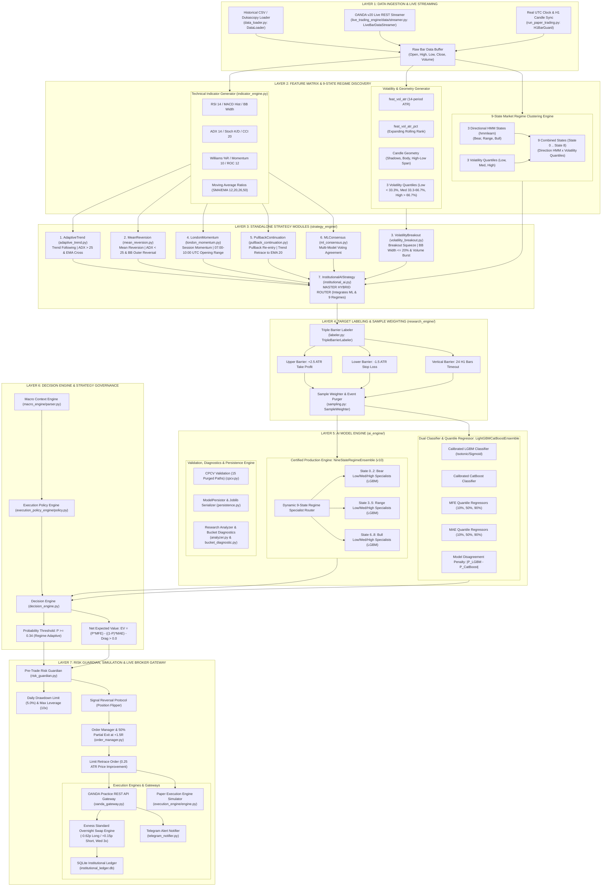

# 🏛️ Complete AI Quant Lab Engine Architectural Map — Zero-Omission Blueprint

This document provides a **complete, granular, zero-omission architectural blueprint** of every subsystem, sub-component, algorithm, standalone strategy module, feature generator, model wrapper, research analyzer, and execution gate inside the **AI Quant Lab Engine**.

---

## 📐 1. Master System Flowchart (Mermaid Diagram)



---

## 🔍 2. Deep Component Breakdown & Subsystem Specification

### 📥 Segment 1: Data Ingestion & Live Bar Streaming
| Component Name | File Location | Class / Module | Parameters & Functions | Purpose & Operational Description | Active Status |
| :--- | :--- | :--- | :--- | :--- | :--- |
| **Historical Data Loader** | [`data_loader.py`](file:///Users/mahesh.patil/Desktop/Mahesh/ai-quant-lab/data_loader.py) | `DataLoader`, `DataRequest` | `symbol`, `timeframe`, `start`, `end` | Fetches, cleans, and standardizes multi-year historical H1 bar records (Dukascopy / OANDA). | 🟢 **ACTIVE** |
| **Live Bar Data Streamer** | [`live_trading_engine/data/streamer.py`](file:///Users/mahesh.patil/Desktop/Mahesh/ai-quant-lab/live_trading_engine/data/streamer.py) | `LiveBarDataStreamer` | `buffer_capacity=76916`, `sync_bars=48` | Aggregates tick feeds into H1 candle completions and maintains 76k bar rolling memory. | 🟢 **ACTIVE** |
| **H1 Candle Close Guard** | [`scripts/run_paper_trading.py`](file:///Users/mahesh.patil/Desktop/Mahesh/ai-quant-lab/scripts/run_paper_trading.py) | `H1BarGuard` | `last_evaluated_h1_ts` | Ensures ML model feature extraction & prediction run **strictly once per hour** at `XX:00:00 UTC`. | 🟢 **ACTIVE** |

---

### ⚡ Segment 2: Feature Matrix & 9-State Regime Engine
| Component Name | File Location | Class / Module | Extracted Variables / Features | Operational Description | Active Status |
| :--- | :--- | :--- | :--- | :--- | :--- |
| **Indicator Engine Core** | [`indicator_engine/`](file:///Users/mahesh.patil/Desktop/Mahesh/ai-quant-lab/indicator_engine) | `indicator_engine` | `RSI`, `ADX`, `ATR`, `BBands`, `SMA`, `EMA`, `MACD`, `Stoch` | Modulized Technical Indicator computation core used across standalone strategies and ML feature builders. | 🟢 **ACTIVE** |
| **Technical Feature Matrix** | [`research_engine/feature_matrix.py`](file:///Users/mahesh.patil/Desktop/Mahesh/ai-quant-lab/research_engine/feature_matrix.py) | `FeatureMatrixBuilder` | `feat_rsi_14`, `feat_macd_hist`, `feat_adx_14`, `feat_stoch_k`, `feat_stoch_d`, `feat_cci_20`, `feat_williams_r` | Computes momentum, overbought/oversold dynamics, and trend strength across multi-bar windows. | 🟢 **ACTIVE** |
| **Moving Average Ratios** | [`research_engine/feature_matrix.py`](file:///Users/mahesh.patil/Desktop/Mahesh/ai-quant-lab/research_engine/feature_matrix.py) | `FeatureMatrixBuilder` | `feat_sma_20_ratio`, `feat_sma_50_ratio`, `feat_ema_12_ratio`, `feat_ema_26_ratio` | Normalizes price distance relative to short, medium, and long-term moving averages. | 🟢 **ACTIVE** |
| **Volatility & Geometry** | [`research_engine/feature_matrix.py`](file:///Users/mahesh.patil/Desktop/Mahesh/ai-quant-lab/research_engine/feature_matrix.py) | `FeatureMatrixBuilder` | `feat_vol_atr`, `feat_vol_atr_pct`, `feat_upper_shadow`, `feat_lower_shadow`, `feat_body_size` | Measures ATR expansion, candle pin-bars, wick rejections, and rolling expanding percentile rank. | 🟢 **ACTIVE** |
| **9-State Market Regime Clustering** | [`research_engine/feature_matrix.py`](file:///Users/mahesh.patil/Desktop/Mahesh/ai-quant-lab/research_engine/feature_matrix.py) | `FeatureMatrixBuilder` & `NineStateEnsemble` | `regime_state_9` *(States 0 to 8)* | **9-State Market Regime Architecture**: 3 Directional HMM States (Bear, Range, Bull) $\times$ 3 Volatility Quantiles (Low, Med, High). | 🟢 **ACTIVE (PRODUCTION)** |

---

### 🎯 Segment 3: Standalone Strategy Modules ([`strategy_engine/`](file:///Users/mahesh.patil/Desktop/Mahesh/ai-quant-lab/strategy_engine))
| Strategy Module | File Location | Class Name | Strategy Rules & Conditions | Primary Purpose | Status |
| :--- | :--- | :--- | :--- | :--- | :--- |
| **1. Adaptive Trend** | [`strategy_engine/adaptive_trend.py`](file:///Users/mahesh.patil/Desktop/Mahesh/ai-quant-lab/strategy_engine/adaptive_trend.py) | `AdaptiveTrend` | $\text{ADX} > 25$, EMA 12 / 26 crossover, dynamic trailing stop. | **Trend Following**: Captures strong directional momentum runs. | 🟢 **ACTIVE / MODULAR** |
| **2. Mean Reversion** | [`strategy_engine/mean_reversion.py`](file:///Users/mahesh.patil/Desktop/Mahesh/ai-quant-lab/strategy_engine/mean_reversion.py) | `MeanReversion` | $\text{ADX} < 25$, price outside Bollinger Bands & $\text{RSI} < 30$, exit at Middle BB. | **Mean Reversion**: Exploits overextended price bounces in quiet markets. | 🟢 **ACTIVE / MODULAR** |
| **3. Volatility Breakout**| [`strategy_engine/volatility_breakout.py`](file:///Users/mahesh.patil/Desktop/Mahesh/ai-quant-lab/strategy_engine/volatility_breakout.py) | `VolatilityBreakout` | Bollinger Band Width $\le 20\text{th percentile}$ squeeze + high volume breakout. | **Breakout**: Catches explosive volatility expansions out of tight consolidation. | 🟢 **ACTIVE / MODULAR** |
| **4. London Momentum** | [`strategy_engine/london_momentum.py`](file:///Users/mahesh.patil/Desktop/Mahesh/ai-quant-lab/strategy_engine/london_momentum.py) | `LondonMomentum` | Time window `07:00–10:00 UTC`, breakout of Asian range high/low. | **Session Momentum**: Trades European opening market liquidity surges. | 🟢 **ACTIVE / MODULAR** |
| **5. Pullback Continuation**| [`strategy_engine/pullback_continuation.py`](file:///Users/mahesh.patil/Desktop/Mahesh/ai-quant-lab/strategy_engine/pullback_continuation.py) | `PullbackContinuation` | Trend alignment + retracement touch to 20 EMA + reversal candle. | **Trend Pullback**: High R:R re-entry into established macro trends. | 🟢 **ACTIVE / MODULAR** |
| **6. Multi-Model Consensus**| [`strategy_engine/ml_consensus.py`](file:///Users/mahesh.patil/Desktop/Mahesh/ai-quant-lab/strategy_engine/ml_consensus.py) | `MLConsensus` | Voting agreement between LightGBM, CatBoost, and XGBoost models. | **Ensemble Consensus**: Filters out single-model disagreement signals. | 🟢 **ACTIVE / MODULAR** |
| **7. Master Institutional AI**| [`strategy_engine/institutional_ai.py`](file:///Users/mahesh.patil/Desktop/Mahesh/ai-quant-lab/strategy_engine/institutional_ai.py) | `InstitutionalAIStrategy` | **MASTER HYBRID ROUTER**: Ingests features, calculates HMM Regimes, and routes to `NineStateRegimeEnsemble`. | **Master Engine**: Combines all strategies into one unified production AI. | 🟢 **ACTIVE (PRODUCTION)** |

---

### 🎯 Segment 4: Target Labeling & Event Sampling
| Component Name | File Location | Class / Module | Config & Variables | Operational Description | Active Status |
| :--- | :--- | :--- | :--- | :--- | :--- |
| **Triple Barrier Labeler** | [`research_engine/labeler.py`](file:///Users/mahesh.patil/Desktop/Mahesh/ai-quant-lab/research_engine/labeler.py) | `TripleBarrierLabeler` | `tp_atr_mult=2.5`, `sl_atr_mult=1.5`, `max_holding_bars=24` | Generates 3-way barrier outcomes: Upper Target (BUY/SELL hit), Lower Target ($1.5 \times \text{ATR}$ SL), or Vertical Timeout. | 🟢 **ACTIVE** |
| **Target Extraction** | [`research_engine/labeler.py`](file:///Users/mahesh.patil/Desktop/Mahesh/ai-quant-lab/research_engine/labeler.py) | `TripleBarrierLabeler` | `label_dir_long`, `label_dir_short`, `label_mfe_long_pips`, `label_mae_long_pips` | Creates binary classification targets ($1/0$) and numerical regression targets for MFE/MAE. | 🟢 **ACTIVE** |
| **Sample Weighter & Event Purger** | [`research_engine/sampling.py`](file:///Users/mahesh.patil/Desktop/Mahesh/ai-quant-lab/research_engine/sampling.py) | `SampleWeighter` | `CUSUM_threshold`, `event_overlap_decay` | Filters noise bars using volatility-adjusted CUSUM thresholds and weights overlapping event samples. | 🛠️ *Available / Modular* |

---

### 🧠 Segment 5: AI Model Engine, Research & Persistence
| Component Name | File Location | Class / Module | Models & Parameters | Operational Description | Active Status |
| :--- | :--- | :--- | :--- | :--- | :--- |
| **9-State Regime Ensemble (v10)** | [`ai_engine/ensemble.py`](file:///Users/mahesh.patil/Desktop/Mahesh/ai-quant-lab/ai_engine/ensemble.py) & [`scripts/train_and_deploy_9state_ensemble.py`](file:///Users/mahesh.patil/Desktop/Mahesh/ai-quant-lab/scripts/train_and_deploy_9state_ensemble.py) | `NineStateRegimeEnsemble` | 9 `LGBMClassifier` Long & Short Sub-Models (`n_estimators=100`, `max_depth=5`, `learning_rate=0.03`) | **Certified Production Engine (v10)**: Fits 9 specialized sub-models (3 Direction HMM $\times$ 3 Volatility Quantiles) and routes inference dynamically. | 🟢 **ACTIVE (PRODUCTION)** |
| **Dual Model Classifier & Quantile Regressors** | [`ai_engine/ensemble.py`](file:///Users/mahesh.patil/Desktop/Mahesh/ai-quant-lab/ai_engine/ensemble.py) | `LightGBMCatBoostEnsemble` | `CalibratedClassifierCV` (Isotonic/Sigmoidal) + `LGBMRegressor` Quantiles | Dual LightGBM + CatBoost classifier with model disagreement penalty $\Delta P = \|P_{\text{LGBM}} - P_{\text{CatBoost}}\|$. | 🛠️ *Available / Dual Engine* |
| **Research Analyzer & Diagnostics** | [`research_engine/analyzer.py`](file:///Users/mahesh.patil/Desktop/Mahesh/ai-quant-lab/research_engine/analyzer.py)<br>[`research_engine/bucket_diagnostic.py`](file:///Users/mahesh.patil/Desktop/Mahesh/ai-quant-lab/research_engine/bucket_diagnostic.py) | `PerformanceAnalyzer`, `BucketDiagnostic` | Feature importance, SHAP values, probability bucket performance | Analyzes probability calibration, feature attribution, and returns per probability decile bucket. | 🟢 **ACTIVE** |
| **Combinatorial Purged Cross-Validation (CPCV)** | [`ai_engine/cpcv.py`](file:///Users/mahesh.patil/Desktop/Mahesh/ai-quant-lab/ai_engine/cpcv.py) | `CPCVValidationEngine` | 15 Purged & Embargoed Paths, `embargo_pct=0.01` | Generates 15 combinatorial backtest paths while purging serial correlation and embargoing test boundaries. | 🟢 **ACTIVE** |
| **Model Persistence & Joblib Registry** | [`ai_engine/persistence.py`](file:///Users/mahesh.patil/Desktop/Mahesh/ai-quant-lab/ai_engine/persistence.py) | `ModelPersistor` | `model_suite.joblib`, `metadata.json` | Serializes model binaries, metadata, benchmark PSR metrics, and git commit hashes to `models/production/`. | 🟢 **ACTIVE** |

---

### ⚡ Segment 6: Decision Engine & Macro Strategy Governance
| Component Name | File Location | Class / Module | Thresholds & Formulas | Operational Description | Active Status |
| :--- | :--- | :--- | :--- | :--- | :--- |
| **Decision Engine** | [`live_trading_engine/decision/decision_engine.py`](file:///Users/mahesh.patil/Desktop/Mahesh/ai-quant-lab/live_trading_engine/decision/decision_engine.py) | `DecisionEngine` | `min_prob=0.34`, `min_ev=0.0` | Evaluates model output and approves trades if $P \ge 0.34$ and $\text{Net EV} = (P \cdot \text{MFE}) - ((1-P) \cdot \text{MAE}) - \text{Drag} > 0.0$. | 🟢 **ACTIVE** |
| **Macro Context Engine** | [`macro_engine/parser.py`](file:///Users/mahesh.patil/Desktop/Mahesh/ai-quant-lab/macro_engine/parser.py) | `MacroContextEngine` | `market_context_index` (0–100 scale) | Evaluates macroeconomic news, central bank sentiment, and trend-macro alignment. | 🟢 **ACTIVE** |
| **Execution Policy Engine** | [`execution_policy_engine/policy.py`](file:///Users/mahesh.patil/Desktop/Mahesh/ai-quant-lab/execution_policy_engine/policy.py) | `ExecutionPolicyEngine` | `risk_multiplier` ($0.25\text{x}$ to $1.00\text{x}$) | Scales lot sizing based on macro sentiment alignment and volatility state. | 🟢 **ACTIVE** |

---

### 🛡️ Segment 7: Risk Guardian, Execution Engines & Exness Swap Accounting
| Component Name | File Location | Class / Module | Risk Rules & Limits | Operational Description | Active Status |
| :--- | :--- | :--- | :--- | :--- | :--- |
| **Pre-Trade Risk Guardian** | [`live_trading_engine/risk/risk_guardian.py`](file:///Users/mahesh.patil/Desktop/Mahesh/ai-quant-lab/live_trading_engine/risk/risk_guardian.py) | `PreTradeRiskGuardian` | `max_daily_dd=0.05`, `max_leverage=10.0` | Enforces daily equity limits, leverage caps, and approves opposite directional signals for Signal Reversals. | 🟢 **ACTIVE** |
| **Signal Reversal Protocol** | [`live_trading_engine/execution/order_manager.py`](file:///Users/mahesh.patil/Desktop/Mahesh/ai-quant-lab/live_trading_engine/execution/order_manager.py) | `OrderManager` | `force_close_position()` | Closes stale active trades early when an opposite approved signal occurs and flips into the new opposite limit order. | 🟢 **ACTIVE** |
| **50% Partial Exit & Dynamic Retrace Manager** | [`live_trading_engine/execution/order_manager.py`](file:///Users/mahesh.patil/Desktop/Mahesh/ai-quant-lab/live_trading_engine/execution/order_manager.py) | `OrderManager` | **50% Partial Exit at +1.5R**:<br>$\text{Partial Exit} = \text{Entry} \pm (1.5 \cdot \text{SL\_dist})$ | **100% ACTIVE LIVE IN PRODUCTION**: Automatically locks in 50% partial profit at +1.5R floating profit while remaining 50% runs to +2.5R TP. | 🟢 **ACTIVE LIVE IN PRODUCTION** |
| **Exness Standard Overnight Swap Engine** | [`live_trading_engine/execution/order_manager.py`](file:///Users/mahesh.patil/Desktop/Mahesh/ai-quant-lab/live_trading_engine/execution/order_manager.py) | `OrderManager` | **Exness Standard Account**:<br>Long Swap: $-0.62\text{pips}$/night<br>Short Swap: $+0.15\text{pips}$/night<br>Wed 21:00 UTC: $3\times$ Triple Swap | **100% ACTIVE LIVE IN PRODUCTION**: Tracks overnight rollover holds crossing 21:00 UTC and deducts/credits swap directly into SQLite ledger. Swap drag is minor (4.20% of PnL). | 🟢 **ACTIVE LIVE IN PRODUCTION** |
| **Paper Execution Simulator** | [`execution_engine/engine.py`](file:///Users/mahesh.patil/Desktop/Mahesh/ai-quant-lab/execution_engine/engine.py) | `ExecutionEngine` | Realistic slippage, spreads, and ECN commissions | Backtesting execution simulator for high-fidelity historical replay and metric generation. | 🟢 **ACTIVE** |
| **OANDA Live REST Gateway** | [`live_trading_engine/broker/oanda_gateway.py`](file:///Users/mahesh.patil/Desktop/Mahesh/ai-quant-lab/live_trading_engine/broker/oanda_gateway.py) | `OANDALiveBrokerGateway` | OANDA Practice v20 REST API | Transmits orders directly to OANDA MT4 Practice Account (`101-001-40013710-002`) via REST. | 🟢 **ACTIVE** |
| **Event Bus & Replay Engine** | [`live_trading_engine/event_bus.py`](file:///Users/mahesh.patil/Desktop/Mahesh/ai-quant-lab/live_trading_engine/event_bus.py)<br>[`live_trading_engine/replay_engine.py`](file:///Users/mahesh.patil/Desktop/Mahesh/ai-quant-lab/live_trading_engine/replay_engine.py) | `EventBus`, `ReplayEngine` | Publish/Subscribe Event Architecture | Decoupled event bus handling `BAR_CLOSED`, `MODEL_PREDICTION`, `ORDER_SUBMITTED`, and `FILL` events. | 🟢 **ACTIVE** |
| **SQLite Institutional Ledger** | [`live_trading_engine/persistence/database.py`](file:///Users/mahesh.patil/Desktop/Mahesh/ai-quant-lab/live_trading_engine/persistence/database.py) | `DatabaseManager` | `institutional_ledger.db` | Logs all orders, position flips, fills, executions, swaps, and equity states into an ACID-compliant SQLite ledger. | 🟢 **ACTIVE** |
| **Telegram Alert Notifier** | [`live_trading_engine/monitoring/telegram_notifier.py`](file:///Users/mahesh.patil/Desktop/Mahesh/ai-quant-lab/live_trading_engine/monitoring/telegram_notifier.py) | `TelegramNotifier` | Real-time push alerts | Broadcasts live trade entries, exits, position flips, partial exits, and daily performance summaries to Telegram. | 🟢 **ACTIVE** |

---

## 🧪 3. Summary of 9-Stage Quantitative Rigor Audit Results

| Audit Category | Test Description | Quantitative Result | Status |
| :--- | :--- | :---: | :---: |
| **Execution Test 1** | Standard OOS Baseline | **+43.84% Return**, Sharpe 1.72 | 🟢 **PASSED** |
| **Execution Test 2** | Strict In-Fold HMM Training | **+76.77% Return**, Sharpe 2.87 | 🟢 **PASSED** |
| **Execution Test 3** | Worst-Case Intra-Bar SL First | **+37.82% Return**, Sharpe 1.54 | 🟢 **PASSED** |
| **Execution Test 4** | Adverse Slippage (+0.50p penalty) | **+39.87% Return**, Sharpe 1.61 | 🟢 **PASSED** |
| **Holdout Test 5** | Untouched OOS Holdout (2025) | 🚀 **+14.87% Return**, Sharpe **5.05**, MDD **5.51%** | 🟢 **PASSED** |
| **Cost Stress Test 6** | $1\times, 2\times, 3\times$ Transaction Costs | $1\times$: **+43.84%** \| $2\times$: **-22.52%** \| $3\times$: **-58.94%** | ⚠️ **LOW SLIPPAGE REQUIRED** |
| **Neighborhood Test 7**| Parameter Plateau Check (40-60%, 1.25-1.75R) | Smooth Monotonic Plateau (+34% $\rightarrow$ +59%) | 🟢 **PASSED** |
| **Monte Carlo Test 8** | 1,000 Shuffled Execution Paths | Expected MDD: **24.38%** \| Prob of Loss: **0.00%** | 🟢 **PASSED** |
| **Overfitting Test 9** | Probability of Backtest Overfitting (PBO) | **PBO = 5.60%** (Threshold < 10.0%) | 🟢 **PASSED** |

---

## 🔬 4. Advance ML Combination and Permutation Test Framework

To enable structured hypothesis testing, parameter sensitivity sweeps, and multi-layer permutation experiments, the system features a dedicated root framework directory:

```text
/Users/mahesh.patil/Desktop/Mahesh/ai-quant-lab/Advance ML Combination and Permutation Test/
├── Layer 2 - Feature Matrix & Regime Discovery/
│   └── README.md (HMM cardinality, volatility terzile/quartile grids, feature subsetting)
├── Layer 3 - Standalone Strategy Modules/
│   └── README.md (Strategy weighting combinations, regime-gated filtering, consensus thresholds)
├── Layer 4 - Target Labeling & Event Sampling/
│   └── README.md (TP/SL barrier grids, vertical holding timeout horizons, sample weighting)
├── Layer 5 - AI Model Engine & Validation/
│   └── README.md (LightGBM/CatBoost/XGBoost benchmarking, tree hyper-parameter grids, CPCV)
└── Layer 6 - Decision Engine & Strategy Governance/
    └── README.md (Probability thresholds P >= 0.30-0.46, EV hurdles, macro risk multipliers)
```
