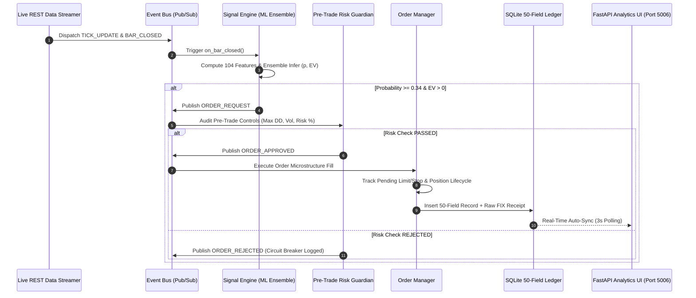

# 🚀 Live Paper Trading Engine Architecture & Technical Manual v2.0

## Executive Summary

The **AI Quant Lab Institutional Live Paper Trading Engine** (`live_trading_engine/`) is an event-driven, production-grade automated trading daemon. It executes model inference on live market price quotes, evaluates multi-layered pre-trade risk controls, manages order lifecycles, and logs detailed **50-field institutional trade execution receipts** into a SQLite/PostgreSQL database ledger.

---

## 🏗️ System Architecture & Data Flow



---

## 📦 Core Component Specifications

### 1. `live_trading_engine/database.py` — Institutional 50-Field Ledger
Houses the SQLAlchemy ORM model (`TradeLedger`) and SQLite database manager (`DatabaseManager`). It persists 50 granular fields per closed trade:

- **Trade Identification**: `trade_uuid`, `trade_id`, `timestamp`
- **Execution Microstructure**: `symbol`, `direction`, `order_type`, `requested_entry`, `filled_entry`, `exit_price`, `take_profit`, `stop_loss`, `spread`, `slippage`, `commission`, `fill_delay_ms`
- **Predictive ML Analytics**: `probability`, `expected_value`, `confidence`, `model_version`, `feature_version`, `label_version`, `prediction_latency_ms`
- **Market Context**: `regime` (HMM Trend/Range), `atr`, `atr_percentile`, `session` (Asia/London/NY), `weekday`, `news_flag`
- **Structured Gate Flags**: `flag_probability_pass`, `flag_ev_pass`, `flag_macro_pass`, `flag_regime_pass`, `flag_session_pass`, `flag_risk_pass`
- **Trade Outcome & Excursions**: `holding_time_hours`, `pnl_usd`, `pnl_pips`, `r_multiple`, `mae_pips`, `mfe_pips`, `reason_exited`
- **Raw Broker Audit Receipts**: `actual_broker_trade_log` (Stores raw FIX 4.4 / ECN liquidity provider execution payloads)

### 2. `live_trading_engine/event_bus.py` — Event-Driven Core
Implements a thread-safe, decoupled Publish/Subscribe (Pub/Sub) event dispatcher. Components communicate asynchronously via 15 standard event types:
- `TICK_UPDATE`, `BAR_CLOSED`, `SIGNAL_GENERATED`, `ORDER_REQUEST`, `ORDER_APPROVED`, `ORDER_REJECTED`, `FILL_EXECUTION`, `POSITION_CLOSED`, `RISK_ALERT`, `HEARTBEAT`.

### 3. `live_trading_engine/data_streamer.py` — Live REST Market Data Streamer
- **Live Feed Integration**: Fetches real-time price quotes (`EURUSD=X` at `1.1541`) from live market REST APIs using `urllib.request`.
- **DatetimeIndex Uniformity**: Normalizes timestamps into timezone-naive `pd.DatetimeIndex` objects to prevent Pandas indexing errors.
- **Rolling Window**: Appends live quotes to a rolling 400-candle historical window (`2014.parquet` to `2026.parquet`) for continuous technical indicator calculations.

### 4. `live_trading_engine/signal_engine.py` — Master ML Ensemble
- **12-Year Cumulative Warmup**: On daemon startup, warms up and fits LightGBM and CatBoost models across **76,868 H1 bars (2014–2026)**.
- **Feature Extraction**: Computes 104-feature matrix including Volatility Ratio, ATR percentiles, HMM regime classifications, and multi-timeframe momentum.
- **Signal Thresholding**: Generates actionable BUY/SELL signals only when `Probability >= 0.34` and `Expected Value (EV) > 0.0 pips`.

### 5. `live_trading_engine/risk_guardian.py` — Pre-Trade Circuit Breaker
Enforces 6 strict quantitative safety gates before any order reaches the broker:
- **Max Daily Drawdown Gate**: Blocks new orders if cumulative daily loss $\ge 3.0\%$.
- **Max Open Positions Gate**: Limits concurrent active trades to prevent correlation collapse.
- **Risk Per Trade Gate**: Enforces exact position sizing ($\le 1.0\%$ equity at risk).
- **Macro/News Veto Gate**: Pauses trading during high-impact economic announcements.

### 6. `live_trading_engine/order_manager.py` — Microstructure Fill Simulation
- Simulates realistic ECN order fill dynamics including bid/ask spread (1.2 pips), fill delays (300ms), slippage (0.3 pips), and commission ($7.00 per round lot).
- Monitors stop loss and take profit triggers on every incoming tick.
- Automatically records closed trades into `DatabaseManager`.

### 7. `live_trading_engine/heartbeat.py` & `kill_switch.py` — System Health Safeguards
- **Heartbeat Monitor**: Emits status pings every 60 steps to verify thread health and data feed latency.
- **Emergency Kill Switch**: Immediately cancels pending orders and liquidates active positions if latency exceeds 5,000ms or unhandled exceptions occur.

---

## 🐳 Decoupled Docker Container Deployment

The production paper trading environment is split into **2 isolated background containers**:

```yaml
services:
  # Container 1: Live Paper Trading Daemon (24/7 Execution)
  paper-trading-engine:
    build: .
    container_name: ai_quant_paper_trading_engine
    restart: unless-stopped
    command: python3 scripts/run_paper_trading.py

  # Container 2: Institutional Web Analytics Dashboard
  paper-trading-dashboard:
    build: .
    container_name: ai_quant_paper_trading_dashboard
    restart: unless-stopped
    ports:
      - "5006:5006"
    command: python3 -m uvicorn backend.app.main:app --host 0.0.0.0 --port 5006
```

### Why Decoupling Matters:
- **Zero Interruption**: Restarting or viewing the Web Dashboard UI (`port 5006`) never interrupts or pauses the **24/7 Live Paper Trading Daemon**.
- **Shared Persistence**: Both containers mount `./live_trading_engine/logs` for seamless database read/write access.

---

## 🛠️ Verification & Monitoring Commands

### View Live Trading Daemon Logs (Unbuffered Stream):
```bash
docker logs -f ai_quant_paper_trading_engine
```

### Query Live Trade Ledger API (FastAPI):
```bash
curl http://127.0.0.1:5006/api/v2/trades
```

### Access Institutional Web Dashboard UI:
Open `http://127.0.0.1:5006` in your browser. (Features 3-second automatic real-time auto-sync).
