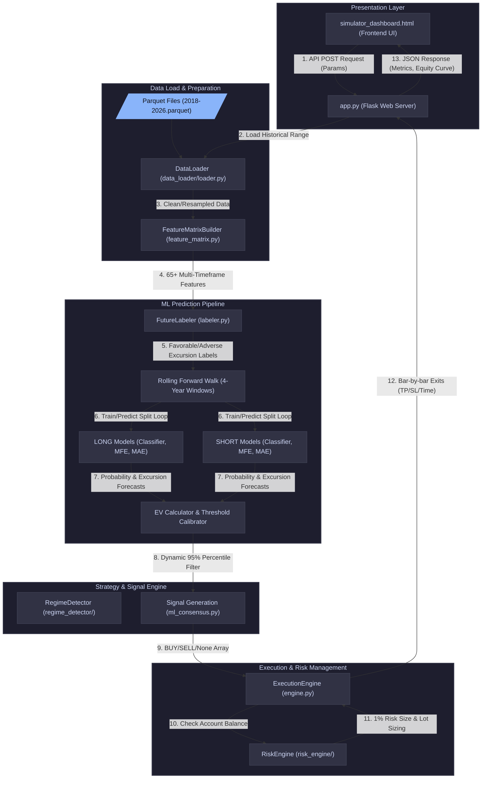

# 📐 AI Quant Lab — Detailed Architecture & Dataflow Diagram

---

## 1. System Architecture Diagram

This diagram shows the complete end-to-end flow of data—from raw Parquet files to the interactive browser dashboard and trade executions.

---

## 2. In-Depth Phase Breakdown

### Phase A: Data Ingestion & Standardization
1. **Raw Storage:** Historical data is stored as yearly split `.parquet` files for efficiency (located in `/market_data_pipeline/output/`).
2. **DataLoader:** Checks the index for monotonicity, cleans duplicate timestamps, handles standard Forex weekend gaps (Friday 21:00 UTC to Sunday 21:00 UTC), and resamples lower-level bars (e.g. 1-minute) to the execution timeframe (1-hour) on the fly if needed.

### Phase B: Feature Engineering (No Lookahead Bias)
1. **FeatureMatrixBuilder:** Generates 65+ features across 7 groups (Trend, Volatility, Price Structure, Sessions, Liquidity, Momentum, and non-linear interactions).
2. **Anti-Leakage Shift:** Features computed on higher timeframes (like H4) are shifted by 1 bar (`shift(1)`) prior to forward-filling onto the H1 execution timeframe. This guarantees the model only uses data that was historically available at the moment of prediction.

### Phase C: Target Labeling & ML Forward Walk
1. **FutureLabeler:** Calculates future market targets over a 12-hour horizon:
   - **MFE (Max Favorable Excursion):** How high (for long) or low (for short) the price went.
   - **MAE (Max Adverse Excursion):** The worst drop (for long) or rise (for short) against the entry.
2. **Rolling Windows:** The walk trains HistGradientBoosting estimators (1 classifier + 2 regressors per direction) on a rolling 4-year block (e.g. 2018-2021) to predict the out-of-sample data for the next year (2022).

### Phase D: Sizing & Bar-by-Bar Execution
1. **Signal Trigger:** The entry signal (BUY/SELL) is triggered only if the expected value (EV) is above the Top 5% threshold *and* outside the banned NY session hours (13:00 to 16:00 UTC).
2. **Risk Sizing:** The `RiskEngine` reads the current balance, calculates the maximum cash risk (1% of equity), and divides it by the predicted stop loss size (in pips) to determine the exact trade size.
3. **Simulated Matching:** The `ExecutionEngine` simulates trade progress bar-by-bar, testing whether the bar's High/Low values hit the Take Profit, Stop Loss, or if the 12-hour hold limit expired.
