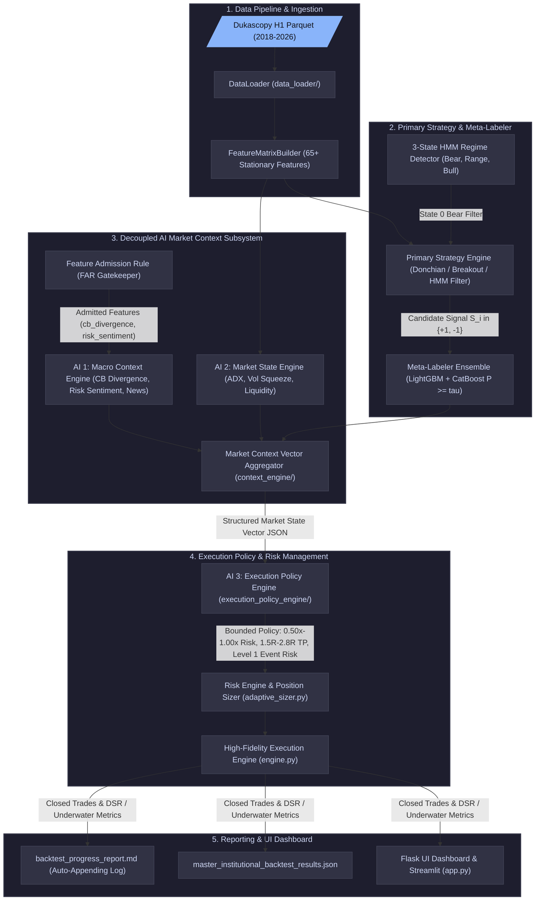

# 📐 AI Quant Lab — Master System Architecture & Dataflow Specification

---

## 1. High-Level Decoupled Architecture Flowchart

---

## 2. In-Depth Component Specification

### Phase A: Data Ingestion & Stationary Feature Pipeline
1. **Dukascopy Data Pipeline**: Stores clean 1-hour OHLCV candle data in `/market_data_pipeline/output/`.
2. **DataLoader (`data_loader/`)**: Standardizes timestamps, handles Forex weekend gaps (Friday 21:00 UTC to Sunday 21:00 UTC), and verifies monotonicity.
3. **FeatureMatrixBuilder (`research_engine/`)**: Generates 65+ technical and market features with anti-leakage time shifting (`shift(1)` on higher timeframes).

### Phase B: Primary Strategy & Meta-Labeling Core
1. **Primary Strategy Engine (`strategy_engine/institutional_ai.py`)**:
   - Generates directional setup candidates ($S_i \in \{+1, -1\}$).
   - Integrates 3-State Hidden Markov Model (`feat_hmm_regime`): State 0 (Bear Trend, $-1.83\text{ pips/hr}$ drift), State 1 (Range / Low Vol), State 2 (Bull Trend, $+0.77\text{ pips/hr}$ drift).
   - Applies targeted Bear Regime Filter (`long_ok & ~((feat_hmm_regime == 0) & (pred_prob_long < 0.60))`).
   - Calibrates **independent Long vs Short probability thresholds** (`prob_threshold_long` vs `prob_threshold_short`) to ensure symmetric selection.

### Phase C: Decoupled AI Market Context Subsystem
1. **Permanent Feature Admission Rule Engine (`ai_engine/feature_admission.py`)**:
   - Audits every candidate feature before allowing it into production.
   - Enforces $N_{\text{bucket}} \ge 200$ sample floor, Spearman rank correlation $r_s \ge +0.70$, $\Delta\text{PF} \ge +0.10$, and 2-year rolling walk-forward consistency ($>60.0\%$).
   - Certified Features: `cb_divergence` (Fed vs ECB interest rate divergence, PF Delta $+0.26$, 100% WF) and `risk_sentiment` (Volatility Squeeze & ATR rank, rs $+1.00$, 71.4% WF).
2. **AI 1 — Macro Context Engine (`macro_engine/`)**:
   - Computes certified macro sub-scores and aggregates them into the **Certified Market Context Index ($0-100$)**:
     $$\text{Certified Market Context Index} = 0.60 \cdot \text{cb\_divergence} + 0.40 \cdot \text{risk\_sentiment}$$
3. **AI 2 — Quantitative Market State Engine (`market_state_engine/`)**:
   - Calculates deterministic $0-100$ scores for Trend Strength (ADX), Volatility Squeeze, and Liquidity Density.
4. **Market Context Vector Aggregator (`context_engine/`)**:
   - Combines outputs into a unified JSON state vector passed to AI 3.

### Phase D: Bounded Execution Policy & Simulation Engine
1. **AI 3 — Execution Policy Engine (`execution_policy_engine/`)**:
   - Maps market state vectors into bounded execution multipliers:
     - **Defensive Position Sizing**: $0.50\times - 1.00\times$ base risk.
     - **Level 1 Event Risk Reduction**: When `event_risk >= 80.0` (30–60 mins near NFP/CPI/FOMC), applies $0.50\times$ risk + 6-hour tight exit horizon.
     - **TP Multiple Escalation**: Step escalation ($1.5\text{R} - 2.8\text{R}$).
     - **Audit-Ready Explainability**: Generates structured JSON explainability payloads for trade logging.
2. **Execution Engine (`execution_engine/`)**:
   - Simulates bar-by-bar matching with $1.50\text{ pips}$ transaction cost drag ($1.20\text{ pips}$ spread + $0.30\text{ pips}$ slippage/latency).
   - Computes **Lopez de Prado Deflated Sharpe Ratio (DSR)** and exact underwater drawdown duration.
