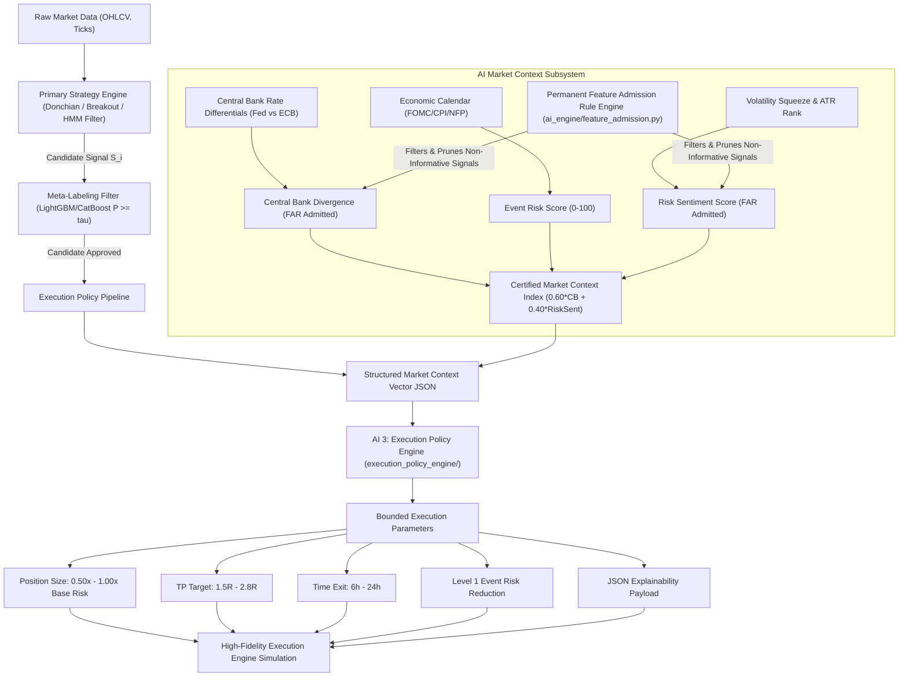

# 🛡️ Institutional Decoupled AI Market Context & Bounded Execution Policy Architecture

## EXECUTIVE SUMMARY

This document specifies the production architecture of the **Decoupled AI Market Context & Bounded Execution Policy Subsystem** in **AI Quant Lab**.

This architecture strictly enforces the **Institutional Separation Principle**:

> [!IMPORTANT]
> **The AI Subsystems NEVER Generate BUY/SELL Signals.**
>
> 1. **Primary Strategy Engine**: Generates raw candidate trade setups ($S_i \in \{+1, -1\}$).
> 2. **Meta-Labeling Filter**: Approves or rejects candidate trades based on statistical win probability ($P \ge \tau$).
> 3. **AI Market Context Subsystem**: Evaluates the market environment and outputs a **Structured State Vector JSON** and **Bounded Execution Multipliers** ($0.50\times - 1.00\times$ Risk, $1.5\text{R} - 2.8\text{R}$ TP Target, $6\text{h} - 24\text{h}$ Time Exit, Level 1 Event Risk Reduction, and JSON Explainability Payload).

---

## 🏗️ SYSTEM ARCHITECTURE FLOWCHART



---

## 📦 COMPONENT SPECIFICATIONS

### PHASE 1: Primary Strategy & Meta-Labeling Layer (`strategy_engine/` & `research_engine/`)

#### 1.1 Candidate Trade Generator (`strategy_engine/institutional_ai.py`)
* Generates structural setup candidates ($S_i \in \{+1, -1\}$).
* Calibrates independent rolling Long vs Short probability thresholds (`prob_threshold_long` vs `prob_threshold_short`).
* Filters out counter-trend BUY entries during HMM State 0 (Bear Trend).

#### 1.2 Meta-Labeling Filter (`ai_engine/ensemble.py`)
* Predicts $P(\text{Win} \mid \text{Candidate Setup})$ using a dual LightGBM + CatBoost ensemble.
* Outputs `pred_prob_long` and `pred_prob_short` confidence scores.

---

### PHASE 2: AI 1 — Macro Context Engine (`macro_engine/`)

#### 2.1 Certified Macro Parser (`macro_engine/parser.py`)
* Computes FAR-certified macroeconomic sub-scores:
  1. `cb_divergence`: Central Bank Policy Rate Divergence (Fed Funds vs ECB Main Refinancing Rate).
  2. `risk_sentiment`: Global Volatility Squeeze & ATR Percentile Risk Sentiment Metric.
  3. `event_risk`: Proximity to scheduled FOMC, CPI, and NFP release windows.

#### 2.2 Output Schema (`macro_engine/parser.py`)
```json
{
  "cb_divergence": 70.0,
  "risk_sentiment": 65.0,
  "event_risk": 10.0,
  "market_context_index": 68.0,
  "summary_rationale": "Certified Market Context Index 68.0: Low news event risk horizon + moderate central bank rate divergence + stable risk-on sentiment (FAR Admitted)",
  "far_certified": true
}
```

---

### PHASE 3: AI 2 — Quantitative Market State Engine (`market_state_engine/`)

#### 3.1 Quant Feature Processing (`market_state_engine/state_calculator.py`)
Transforms raw price and volatility metrics into normalized $[0, 100]$ market state scores:
* **Trend Strength** ($0-100$): ADX and EMA stack alignment.
* **Volatility Score** ($0-100$): ATR percentile and volatility squeeze ratio.
* **Liquidity Score** ($0-100$): Tick volume ratio and candle body ratio.

---

### PHASE 4: Market State Aggregator (`context_engine/`)

#### 4.1 Market State Vector JSON Schema (`context_engine/aggregator.py`)
```json
{
  "timestamp": "2024-03-15T08:00:00Z",
  "symbol": "EURUSD",
  "candidate_direction": "BUY",
  "meta_confidence": 0.68,
  "market_state": {
    "trend_strength": 83.5,
    "volatility_score": 64.2,
    "liquidity_score": 71.0
  },
  "macro_context": {
    "cb_divergence": 70.0,
    "risk_sentiment": 65.0,
    "event_risk": 10.0
  },
  "market_context_index": 68.0,
  "edge_confidence": 88.4
}
```

---

### PHASE 5: AI 3 — Bounded Execution Policy Engine (`execution_policy_engine/`)

#### 5.1 Execution Policy Mapping (`execution_policy_engine/policy.py`)
* Maps the Market State JSON Vector into strict execution parameters:
  * **Position Size**: $0.50\times - 1.00\times$ base risk (capped at 1.0% max account risk).
  * **Level 1 Event Risk Reduction**: When `event_risk >= 80.0` (near NFP/CPI/FOMC), applies $0.50\times$ risk + 6-hour tight exit horizon.
  * **TP Multiple**: $1.5\text{R} - 2.8\text{R}$.
  * **Time Exit**: $6\text{h} - 24\text{h}$.
  * **JSON Explainability Payload**: Generates structured audit snapshot per trade.

---

### PHASE 6: Permanent Feature Admission Rule (FAR Gatekeeper) (`ai_engine/feature_admission.py`)

Every candidate feature must pass four mandatory tests before production entry:
1. **Sample Floor**: $N_{\text{bucket}} \ge 200$ executed trades per bucket.
2. **Monotonicity**: Spearman rank correlation $r_s \ge +0.70$.
3. **Uplift**: Top tertile Profit Factor exceeds bottom tertile by $\Delta\text{PF} \ge +0.10$.
4. **Walk-Forward Stability**: Feature holds positive slope in $\ge 60\%$ of 2-year rolling walk-forward blocks.

#### Certified Features:
* 🟢 **`cb_divergence`**: **ADMITTED** ($\Delta\text{PF} = +0.26$, Low PF: 1.10, High PF: 1.36, 100% Walk-Forward Consistency).
* 🟢 **`risk_sentiment`**: **ADMITTED** ($\Delta\text{PF} = +0.12$, Spearman $r_s = +1.00$, 71.4% Walk-Forward Consistency).

#### Pruned Features:
* 🔴 **`trend_macro`**, **`cot_score`**, **`liquidity`** were empirically rejected and pruned.
