# 🏛️ Complete AI Quant Lab Engine Architectural Map — Production Baseline Specification

This document provides a **complete, granular, zero-omission architectural blueprint** of every subsystem, sub-component, algorithm, strategy module, feature generator, model wrapper, research analyzer, risk guardian, and execution gate inside the **AI Quant Lab Engine**.

---

## 📐 1. Master System Flowchart (Mermaid Diagram)

```mermaid
flowchart TD
    %% LAYER 1: DATA INGESTION & LIVE STREAMING
    subgraph L1 ["LAYER 1: DATA INGESTION & LIVE STREAMING"]
        A1["Historical CSV / Dukascopy Loader<br/>(historical_data_ingestion.py: DataLoader)"]
        A2["OANDA v20 Live REST Streamer<br/>(live_execution_engine/local_data_workspace/oanda_provider.py)"]
        A3["Real UTC Clock & H1 Candle Sync<br/>(h1_bar_guard.py: H1BarGuard)"]
        A1 --> B1
        A2 --> B1
        A3 --> B1
    end

    %% LAYER 2: FEATURE ENGINEERING & 9-STATE REGIME DISCOVERY
    subgraph L2 ["LAYER 2: FEATURE MATRIX & 9-STATE REGIME DISCOVERY"]
        B1["Raw Bar Data Buffer<br/>(Open, High, Low, Close, Volume)"]
        
        subgraph F_TECH ["Technical Indicator Generator (indicator_engine/)"]
            F1["RSI 14 / MACD Hist / BB Width"]
            F2["ADX 14 / Stoch K/D / CCI 20"]
            F3["Williams %R / Momentum 10 / ROC 12"]
            F4["Moving Average Ratios (SMA/EMA 12,20,26,50)"]
        end
        
        subgraph F_VOL ["Volatility & Geometry Generator"]
            F5["feat_vol_atr (14-period ATR)"]
            F6["feat_vol_atr_pct (Expanding Rolling Rank)"]
            F7["Candle Geometry (Shadows, Body, High-Low Span)"]
            F8["3 Volatility Quantiles (Low < 33.3%, Med 33.3-66.7%, High > 66.7%)"]
        end
        
        subgraph F_HMM ["9-State Market Regime Clustering Engine"]
            F9["3 Directional HMM States (hmmlearn)<br/>(Bear, Range, Bull)"]
            F10["3 Volatility Quantiles (Low, Med, High)"]
            F11["9 Combined States (State 0 .. State 8)<br/>(Direction HMM x Volatility Quantiles)"]
            F9 --> F11
            F10 --> F11
        end

        B1 --> F_TECH
        B1 --> F_VOL
        B1 --> F_HMM
    end

    %% LAYER 3: STANDALONE STRATEGY MODULES & HYBRID ROUTER
    subgraph L3 ["LAYER 3: STANDALONE STRATEGY MODULES (strategy_engine/)"]
        S1["1. AdaptiveTrend (adaptive_trend.py)<br/>Trend Following | ADX > 25 & EMA Cross"]
        S2["2. MeanReversion (mean_reversion.py)<br/>Mean Reversion | ADX < 25 & BB Outer Reversal"]
        S3["3. VolatilityBreakout (volatility_breakout.py)<br/>Breakout Squeeze | BB Width <= 20% & Volume Burst"]
        S4["4. LondonMomentum (london_momentum.py)<br/>Session Momentum | 07:00-10:00 UTC Opening Range"]
        S5["5. PullbackContinuation (pullback_continuation.py)<br/>Pullback Re-entry | Trend Retrace to EMA 20"]
        S6["6. MLConsensus (ml_consensus.py)<br/>Multi-Model Voting Agreement"]
        S7["7. InstitutionalAIStrategy (institutional_ai.py)<br/>MASTER HYBRID ROUTER (Integrates ML & 9 Regimes)"]

        F_TECH --> S1
        F_TECH --> S2
        F_VOL --> S3
        F_TECH --> S4
        F_TECH --> S5
        F_TECH --> S6
        F_HMM --> S7
        S1 --> S7
        S2 --> S7
        S3 --> S7
        S4 --> S7
        S5 --> S7
        S6 --> S7
    end

    %% LAYER 4: TARGET LABELING & SAMPLING
    subgraph L4 ["LAYER 4: TARGET LABELING & SAMPLE WEIGHTING (research_and_training_engine/)"]
        C1["Triple Barrier Labeler<br/>(labeler.py: TripleBarrierLabeler)"]
        C2["Upper Barrier: +2.5 ATR Take Profit"]
        C3["Lower Barrier: -1.5 ATR Stop Loss"]
        C4["Vertical Barrier: 24 H1 Bars Timeout"]
        C5["Sample Weighter & Event Purger<br/>(sampling.py: SampleWeighter)"]
        
        S7 --> C1
        C1 --> C2
        C1 --> C3
        C1 --> C4
        C2 --> C5
        C3 --> C5
        C4 --> C5
    end

    %% LAYER 5: AI MACHINE LEARNING MODEL ENSEMBLE
    subgraph L5 ["LAYER 5: AI MODEL ENGINE (core_machine_learning/)"]
        subgraph REGIME_FUSED ["Certified Production Engine: NineStateRegimeEnsemble (v10)"]
            M1["State 0..2: Bear Low/Med/High Specialists (LGBM)"]
            M2["State 3..5: Range Low/Med/High Specialists (LGBM)"]
            M3["State 6..8: Bull Low/Med/High Specialists (LGBM)"]
            M4["Dynamic 9-State Regime Specialist Router"]
            M4 --> M1
            M4 --> M2
            M4 --> M3
        end

        subgraph DUAL_ENSEMBLE ["Triple Stacking Ensemble V1: LGBM + CatBoost + XGBoost"]
            M5["Calibrated LGBM Classifier"]
            M6["Calibrated CatBoost Classifier"]
            M7["Calibrated XGBoost Classifier"]
            M8["Contextual MDE System (Macro-Regime Multiplier)"]
            M9["Disagreement Penalty: |P_LGBM - P_CatBoost - P_XGBoost|"]
        end

        subgraph VAL_PERSIST ["Validation, Diagnostics & Persistence Engine"]
            M10["CPCV Validation (15 Purged Paths) (cpcv.py)"]
            M11["ModelPersistor & Joblib Serializer (persistence.py)"]
            M12["Research Analyzer & Bucket Diagnostics"]
        end

        C5 --> REGIME_FUSED
        C5 --> DUAL_ENSEMBLE
    end

    %% LAYER 6: DECISION ENGINE & MACRO GOVERNANCE
    subgraph L6 ["LAYER 6: DECISION ENGINE & STRATEGY GOVERNANCE"]
        D1["PAE Decision Guard (pae_decision_guard.py)"]
        D2["Probability Threshold: P >= 0.36 (Regime Adaptive)"]
        D3["Net Expected Value: EV = (P*Win_R) - ((1-P)*Loss_R) - Drag > 0.0"]
        D4["Decision Trail Logger (12 Rejection Reason Codes)"]
        
        REGIME_FUSED --> D1
        DUAL_ENSEMBLE --> D1
        D1 --> D2
        D1 --> D3
        D1 --> D4
    end

    %% LAYER 7: RISK GUARDIAN, EXECUTION ENGINES & FORWARD TELEMETRY
    subgraph L7 ["LAYER 7: RISK GUARDIAN, EXECUTION ENGINES & FORWARD TELEMETRY"]
        E1["Pre-Trade Risk Guardian (risk_guardian.py)"]
        E2["Daily Drawdown Limit (3.0%) & Max Leverage (20x)"]
        E3["Signal Reversal Protocol (Position Flipper)"]
        E4["Order Manager & 50% Partial Exit at +1.5R (order_manager.py)"]
        E5["Limit Retrace Order (0.25 ATR Price Improvement)"]
        
        subgraph BROKER_EXEC ["Execution Engines & Gateways"]
            E6["OANDA Practice REST API Gateway (oanda_gateway.py)"]
            E7["SQLite Master Ledger (sqlite_ledger_guard.py)"]
            E8["33-Point Forward Telemetry Tracker (telemetry_tracker.py)"]
            E9["Distributional Parity Comparator (KS-test Engine)"]
            E10["Telegram Alert Notifier (telegram_alert_guard.py)"]
        end

        D2 --> E1
        D3 --> E1
        E1 --> E2
        E1 --> E3
        E3 --> E4
        E4 --> E5
        E5 --> E6
        E6 --> E7
        E7 --> E8
        E8 --> E9
        E6 --> E10
    end
```

---

## 🔍 2. Deep Component Breakdown & Subsystem Specification

### 📥 Segment 1: Data Ingestion & Live Bar Streaming
| Component Name | File Location | Class / Module | Parameters & Functions | Purpose & Operational Description | Active Status |
| :--- | :--- | :--- | :--- | :--- | :--- |
| **Historical Data Loader** | [`historical_data_ingestion.py`](file:///Users/mahesh.patil/Desktop/Mahesh/ai-quant-lab/historical_data_ingestion.py) | `DataLoader`, `DataRequest` | `symbol`, `timeframe`, `start`, `end` | Fetches, cleans, and standardizes multi-year historical H1 bar records (Dukascopy / OANDA). | 🟢 **ACTIVE** |
| **Live Bar Data Streamer** | [`live_execution_engine/local_data_workspace/streamer.py`](file:///Users/mahesh.patil/Desktop/Mahesh/ai-quant-lab/live_execution_engine/local_data_workspace/streamer.py) | `LiveBarDataStreamer` | `buffer_capacity=76916`, `sync_bars=48` | Aggregates tick feeds into H1 candle completions and maintains 76k bar rolling memory. | 🟢 **ACTIVE** |
| **H1 Candle Close Guard** | [`live_execution_engine/local_data_workspace/h1_bar_guard.py`](file:///Users/mahesh.patil/Desktop/Mahesh/ai-quant-lab/live_execution_engine/local_data_workspace/h1_bar_guard.py) | `H1BarGuard` | `last_evaluated_h1_ts` | Validates OHLC bounds, timestamp monotonicity, suppresses duplicate candles, and flags missing gaps. | 🟢 **ACTIVE** |

---

### ⚡ Segment 2: Feature Matrix & 9-State Regime Engine
| Component Name | File Location | Class / Module | Extracted Variables / Features | Operational Description | Active Status |
| :--- | :--- | :--- | :--- | :--- | :--- |
| **Indicator Engine Core** | [`indicator_engine/`](file:///Users/mahesh.patil/Desktop/Mahesh/ai-quant-lab/indicator_engine) | `indicator_engine` | `RSI`, `ADX`, `ATR`, `BBands`, `SMA`, `EMA`, `MACD`, `Stoch` | Modulized Technical Indicator computation core used across standalone strategies and ML feature builders. | 🟢 **ACTIVE** |
| **Technical Feature Matrix** | [`research_and_training_engine/feature_matrix.py`](file:///Users/mahesh.patil/Desktop/Mahesh/ai-quant-lab/research_and_training_engine/feature_matrix.py) | `FeatureMatrixBuilder` | `feat_rsi_14`, `feat_macd_hist`, `feat_adx_14`, `feat_stoch_k`, `feat_stoch_d`, `feat_cci_20`, `feat_williams_r` | Computes momentum, overbought/oversold dynamics, and trend strength across multi-bar windows. | 🟢 **ACTIVE** |
| **Moving Average Ratios** | [`research_and_training_engine/feature_matrix.py`](file:///Users/mahesh.patil/Desktop/Mahesh/ai-quant-lab/research_and_training_engine/feature_matrix.py) | `FeatureMatrixBuilder` | `feat_sma_20_ratio`, `feat_sma_50_ratio`, `feat_ema_12_ratio`, `feat_ema_26_ratio` | Normalizes price distance relative to short, medium, and long-term moving averages. | 🟢 **ACTIVE** |
| **Volatility & Geometry** | [`research_and_training_engine/feature_matrix.py`](file:///Users/mahesh.patil/Desktop/Mahesh/ai-quant-lab/research_and_training_engine/feature_matrix.py) | `FeatureMatrixBuilder` | `feat_vol_atr`, `feat_vol_atr_pct`, `feat_upper_shadow`, `feat_lower_shadow`, `feat_body_size` | Measures ATR expansion, candle pin-bars, wick rejections, and rolling expanding percentile rank. | 🟢 **ACTIVE** |
| **9-State Market Regime Clustering** | [`live_execution_engine/decision/hmm_guard.py`](file:///Users/mahesh.patil/Desktop/Mahesh/ai-quant-lab/live_execution_engine/decision/hmm_guard.py) | `HMMRegimeGuard` & `NineStateEnsemble` | `regime_state_9` *(States 0 to 8)* | **9-State Market Regime Architecture**: 3 Directional HMM States (Bear, Range, Bull) $\times$ 3 Volatility Quantiles (Low, Med, High). | 🟢 **ACTIVE (PRODUCTION)** |

---

### 🎯 Segment 3: Standalone Strategy Modules ([`strategy_engine/`](file:///Users/mahesh.patil/Desktop/Mahesh/ai-quant-lab/strategy_engine))
| Strategy Module | File Location | Class Name | Strategy Rules & Conditions | Primary Purpose | Status |
| :--- | :--- | :--- | :--- | :--- | :--- |
| **1. Adaptive Trend** | [`strategy_engine/adaptive_trend.py`](file:///Users/mahesh.patil/Desktop/Mahesh/ai-quant-lab/strategy_engine/adaptive_trend.py) | `AdaptiveTrend` | $\text{ADX} > 25$, EMA 12 / 26 crossover, dynamic trailing stop. | **Trend Following**: Captures strong directional momentum runs. | 🟢 **ACTIVE / MODULAR** |
| **2. Mean Reversion** | [`strategy_engine/mean_reversion.py`](file:///Users/mahesh.patil/Desktop/Mahesh/ai-quant-lab/strategy_engine/mean_reversion.py) | `MeanReversion` | $\text{ADX} < 25$, price outside Bollinger Bands & $\text{RSI} < 30$, exit at Middle BB. | **Mean Reversion**: Exploits overextended price bounces in quiet markets. | 🟢 **ACTIVE / MODULAR** |
| **3. Volatility Breakout**| [`strategy_engine/volatility_breakout.py`](file:///Users/mahesh.patil/Desktop/Mahesh/ai-quant-lab/strategy_engine/volatility_breakout.py) | `VolatilityBreakout` | Bollinger Band Width $\le 20\text{th percentile}$ squeeze + high volume breakout. | **Breakout**: Catches explosive volatility expansions out of tight consolidation. | 🟢 **ACTIVE / MODULAR** |
| **4. London Momentum** | [`strategy_engine/london_momentum.py`](file:///Users/mahesh.patil/Desktop/Mahesh/ai-quant-lab/strategy_engine/london_momentum.py) | `LondonMomentum` | Time window `07:00–10:00 UTC`, breakout of Asian range high/low. | **Session Momentum**: Trades European opening market liquidity surges. | 🟢 **ACTIVE / MODULAR** |
| **5. Pullback Continuation**| [`strategy_engine/pullback_continuation.py`](file:///Users/mahesh.patil/Desktop/Mahesh/ai-quant-lab/strategy_engine/pullback_continuation.py) | `PullbackContinuation` | Trend alignment + retracement touch to 20 EMA + reversal candle. | **Trend Pullback**: High R:R re-entry into established macro trends. | 🟢 **ACTIVE / MODULAR** |
| **6. Multi-Model Consensus**| [`strategy_engine/ml_consensus.py`](file:///Users/mahesh.patil/Desktop/Mahesh/ai-quant-lab/strategy_engine/ml_consensus.py) | `MLConsensus` | Voting agreement between LightGBM, CatBoost, and XGBoost models. | **Ensemble Consensus**: Filters out single-model disagreement signals. | 🟢 **ACTIVE / MODULAR** |
| **7. Master Institutional AI**| [`strategy_engine/institutional_ai.py`](file:///Users/mahesh.patil/Desktop/Mahesh/ai-quant-lab/strategy_engine/institutional_ai.py) | `InstitutionalAIStrategy` | **MASTER HYBRID ROUTER**: Ingests features, calculates HMM Regimes, and routes to `NineStateRegimeEnsemble`. | **Master Engine**: Combines all strategies into one unified production AI. | 🟢 **ACTIVE (PRODUCTION)** |

---

### 🧠 Segment 4: AI Model Engine, PAE & Model Decision
| Component Name | File Location | Class / Module | Models & Parameters | Operational Description | Active Status |
| :--- | :--- | :--- | :--- | :--- | :--- |
| **9-State Regime Ensemble (v10)** | [`core_machine_learning/ensemble.py`](file:///Users/mahesh.patil/Desktop/Mahesh/ai-quant-lab/core_machine_learning/ensemble.py) | `NineStateRegimeEnsemble` | 9 `LGBMClassifier` Sub-Models (`n_estimators=100`, `max_depth=5`, `learning_rate=0.03`) | Fits 9 specialized sub-models (3 Direction HMM $\times$ 3 Volatility Quantiles) and routes inference dynamically. | 🟢 **ACTIVE (PRODUCTION)** |
| **Triple Stacking Ensemble V1** | [`core_machine_learning/ensemble.py`](file:///Users/mahesh.patil/Desktop/Mahesh/ai-quant-lab/core_machine_learning/ensemble.py) | `TRIPLE_STACKING_ENSEMBLE_V1` | LightGBM + CatBoost + XGBoost Classifiers | Fuses predictions across 3 model families with model disagreement penalties. | 🟢 **ACTIVE (PRODUCTION)** |
| **PAE Decision Guard** | [`live_execution_engine/decision/pae_decision_guard.py`](file:///Users/mahesh.patil/Desktop/Mahesh/ai-quant-lab/live_execution_engine/decision/pae_decision_guard.py) | `PAEDecisionGuard` | `min_prob=0.36`, `min_ev=0.0` | Evaluates ensemble probability, computes R-multiple Expected Value ($\text{EV} > 0.0\text{R}$), and resolves Long/Short conflicts. | 🟢 **ACTIVE (PRODUCTION)** |
| **Decision Trail Logger** | [`live_execution_engine/decision/rejection_logger.py`](file:///Users/mahesh.patil/Desktop/Mahesh/ai-quant-lab/live_execution_engine/decision/rejection_logger.py) | `DecisionTrailLogger` | 12 Primary Rejection Codes | Logs 100% structured JSON audit trails for every approved trade or rejected signal. | 🟢 **ACTIVE (PRODUCTION)** |

---

### 🛡️ Segment 5: Risk Guardian, Execution & OANDA Broker Gateway
| Component Name | File Location | Class / Module | Risk Rules & Limits | Operational Description | Active Status |
| :--- | :--- | :--- | :--- | :--- | :--- |
| **Pre-Trade Risk Guardian** | [`live_execution_engine/risk/risk_guardian.py`](file:///Users/mahesh.patil/Desktop/Mahesh/ai-quant-lab/live_execution_engine/risk/risk_guardian.py) | `RiskGuardian` | `risk_per_trade=0.0075`, `max_daily_dd=0.03`, `max_leverage=20.0` | Enforces 0.75% risk sizing, 3.0% daily drawdown limit, 20:1 max leverage, and 5.0% aggregate exposure cap. | 🟢 **ACTIVE** |
| **Limit Retrace Execution Guard** | [`live_execution_engine/execution/limit_order_guard.py`](file:///Users/mahesh.patil/Desktop/Mahesh/ai-quant-lab/live_execution_engine/execution/limit_order_guard.py) | `LimitOrderGuard` | `retrace_mult=0.25`, `cancel_after_bars=3` | Places limit orders at $0.25\times\text{ATR}$ retrace price improvement with 3-bar auto-expiration. | 🟢 **ACTIVE** |
| **OANDA Live REST Gateway** | [`live_execution_engine/broker/oanda_gateway.py`](file:///Users/mahesh.patil/Desktop/Mahesh/ai-quant-lab/live_execution_engine/broker/oanda_gateway.py) | `OANDALiveBrokerGateway` | OANDA Practice v20 REST API | Transmits orders directly to OANDA Practice Account (`101-001-40013710-003`) via v20 REST API. | 🟢 **ACTIVE** |
| **Order Idempotency Guard** | [`live_execution_engine/execution/idempotency_guard.py`](file:///Users/mahesh.patil/Desktop/Mahesh/ai-quant-lab/live_execution_engine/execution/idempotency_guard.py) | `OrderIdempotencyGuard` | `allow_blind_retry=False` | Suppresses duplicate order events and queries OANDA API on network timeouts before resuming. | 🟢 **ACTIVE** |

---

### 👁️ Segment 6: Forward-Validation System & Telemetry Tracking
| Component Name | File Location | Class / Module | Metrics & Analytics | Operational Description | Active Status |
| :--- | :--- | :--- | :--- | :--- | :--- |
| **Forward Telemetry Tracker** | [`live_execution_engine/forward_validation/telemetry_tracker.py`](file:///Users/mahesh.patil/Desktop/Mahesh/ai-quant-lab/live_execution_engine/forward_validation/telemetry_tracker.py) | `ForwardTelemetryTracker` | 33 Granular Trade Metrics | Persists complete 33-point trade footprint into SQLite WAL database `forward_telemetry.db`. | 🟢 **ACTIVE** |
| **Distributional Parity Comparator** | [`live_execution_engine/forward_validation/distribution_comparator.py`](file:///Users/mahesh.patil/Desktop/Mahesh/ai-quant-lab/live_execution_engine/forward_validation/distribution_comparator.py) | `DistributionComparator` | Kolmogorov-Smirnov (KS-test), Win Rate, PF, Avg R | Compares live demo trade distribution against historical backtest expectations to detect structural alpha drift. | 🟢 **ACTIVE** |
