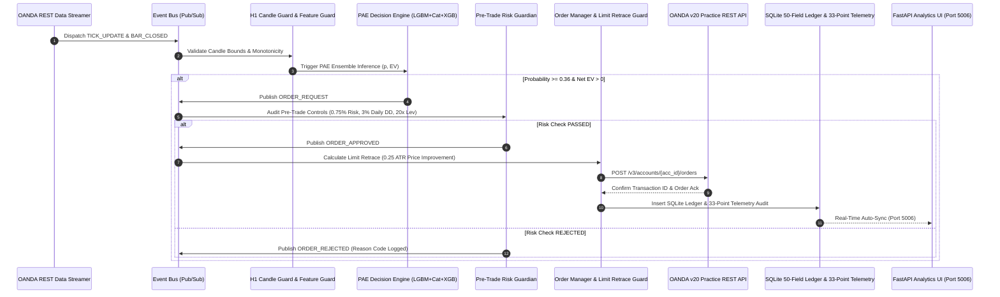

# 🚀 Live Paper Trading Engine Architecture & Technical Manual v3.0

---

## 1. Executive Summary

The **AI Quant Lab Institutional Live Paper Trading Engine** (`live_execution_engine/`) is an event-driven, production-grade automated trading daemon. It executes model inference on live market price quotes, evaluates multi-layered pre-trade risk controls, manages order lifecycles, and logs detailed **50-field institutional trade execution receipts** into SQLite database ledgers alongside a **33-point forward validation telemetry audit**.

---

## 🏗️ 2. System Architecture & Data Flow



---

## 📦 3. Core Component Specifications

### 1. `live_execution_engine/local_data_workspace/h1_bar_guard.py` — H1 Bar Guard
Validates candle integrity before allowing features or ML inference to process:
- Enforces single evaluation per H1 candle close (`XX:00:00 UTC`).
- Verifies OHLC bounds ($L \le O, C \le H$) and monotonic timestamps.
- Suppresses duplicate candles and logs missing gap alerts.

### 2. `live_execution_engine/decision/pae_decision_guard.py` — PAE Decision Engine Guard
Evaluates predictions from the `TRIPLE_STACKING_ENSEMBLE_V1` (LightGBM + CatBoost + XGBoost):
- Computes R-multiple Expected Value: $\text{EV} = P \cdot \text{Win\_R} - (1-P) \cdot \text{Loss\_R} - \text{Friction\_R}$.
- Enforces regime-specific probability thresholds ($P \ge 0.36$ in trend, $P \ge 0.42$ in range).
- Resolves Long/Short conflicts and logs 100% structured JSON rejection audit trails across 12 primary reason codes (`rejection_logger.py`).

### 3. `live_execution_engine/risk/risk_guardian.py` — Pre-Trade Risk Guardian
Enforces capital preservation and risk bounds:
- **Risk Position Sizing**: $0.75\%$ base risk per trade, ATR-adaptive stop distance.
- **Daily Drawdown Gate**: Pauses trading if daily drawdown $\ge 3.0\%$.
- **Leverage Gate**: Caps total position units at $20:1$ leverage.
- **Portfolio Exposure Gate**: Caps total open risk at $5.0\%$ of account equity.

### 4. `live_execution_engine/broker/oanda_gateway.py` — OANDA Live REST Gateway
Directly integrates with OANDA v20 Practice REST API (`api-fxpractice.oanda.com`):
- Submits real Limit Retrace orders, Stop Loss, and Take Profit specifications.
- Queries `GET /v3/accounts/{account_id}/summary` for live NAV reconciliation.
- Suppresses duplicate fill events via `idempotency_guard.py` and avoids blind retries on API timeouts.

### 5. `live_execution_engine/forward_validation/` — 33-Point Forward Telemetry & Parity Engine
- **Telemetry Tracker (`telemetry_tracker.py`)**: Stores 33 granular trade metrics per live trade in SQLite WAL database `forward_telemetry.db`.
- **Distribution Comparator (`distribution_comparator.py`)**: Runs Kolmogorov-Smirnov (KS-test) on realized R returns, comparing live Win Rate, Profit Factor, Average R, slippage, and latency against historical backtest expectations.

---

## 🐳 4. Decoupled Docker Container Deployment

The production environment runs 24/7 inside **2 isolated containers** defined in `docker-compose.yml`:

```yaml
services:
  # Container 1: Live Paper Trading Daemon (24/7 Execution & OANDA REST Gateway)
  paper-trading-engine:
    build: .
    container_name: ai_quant_paper_trading_engine
    restart: unless-stopped
    command: python3 scripts/run_paper_trading.py

  # Container 2: Institutional Web Analytics Dashboard
  paper-trading-dashboard:
    build: .
    container_name: ai_quant_paper_trading_dashboard
    restart: unless-stopped
    ports:
      - "5006:5006"
    command: python3 -m uvicorn backend.app.main:app --host 0.0.0.0 --port 5006
```

---

## 🛠️ 5. Verification & Operational Commands

### Tail Live Engine Logs:
```bash
docker logs -f ai_quant_paper_trading_engine
```

### Run Forward Telemetry Distributional Parity Gauntlet:
```bash
docker exec ai_quant_paper_trading_engine python3 "Forward Trading Validation/run_forward_validation_gauntlet.py"
```

### Reset Account & Local Test Ledgers (Fresh Start):
```bash
docker exec ai_quant_paper_trading_engine python3 scripts/reset_oanda_paper_account.py
docker compose restart
```
