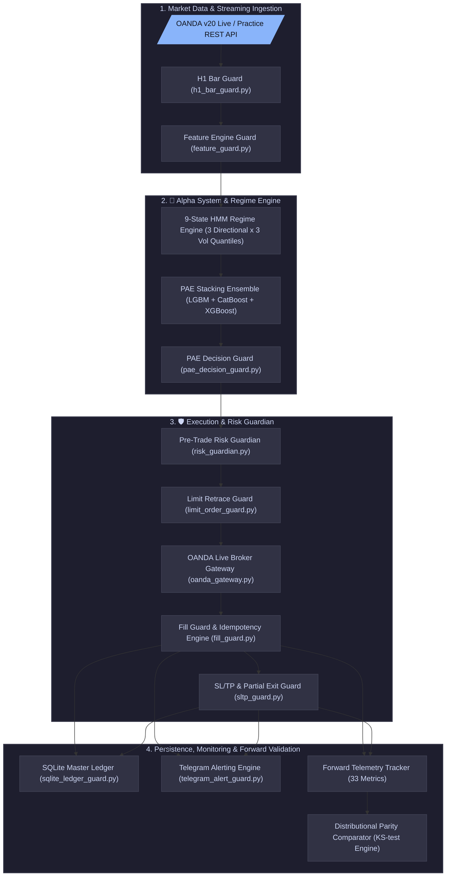

# 📐 AI Quant Lab — Master System Architecture & Infrastructure Specification

---

## 1. Executive Summary & 3-System Architecture

The AI Quant Lab production platform is built upon three decoupled, specialized system layers:

```
┌─────────────────────────────────────────────────────────────────────────┐
│ 🧠 1. ALPHA SYSTEM                                                      │
│ HMM → 9-State Regime → PAE Ensemble → Probability/EV → Trade Decision   │
└─────────────────────────────────────────────────────────────────────────┘
                                    │
                                    ▼
┌─────────────────────────────────────────────────────────────────────────┐
│ 🛡️ 2. EXECUTION / RISK SYSTEM                                           │
│ Risk Guardian → Sizing → Limit Order → OANDA → SL/TP → Partial Exit     │
└─────────────────────────────────────────────────────────────────────────┘
                                    │
                                    ▼
┌─────────────────────────────────────────────────────────────────────────┐
│ 👁️ 3. FORWARD-VALIDATION SYSTEM                                         │
│ 33 Telemetry Metrics → KS-Test → Distributional Parity → Drift Warnings │
└─────────────────────────────────────────────────────────────────────────┘
```

1. **🧠 Alpha System**: Generates statistical edge using 9-State HMM Regime Engine + Predictive Ensemble (`TRIPLE_STACKING_ENSEMBLE_V1`: LightGBM + CatBoost + XGBoost) + Expected Value (EV) filter ($P \ge 0.36$, $\text{EV} > 0.0\text{R}$).
2. **🛡️ Execution & Risk System**: Enforces institutional capital protection via Pre-Trade Risk Guardian, ATR-adaptive sizing (0.75% risk/trade), limit retrace entry ($0.25\times\text{ATR}$), order idempotency, OANDA REST API v20 integration, 50% partial exit @ $+1.5\text{R}$, and atomic SQLite ledger persistence.
3. **👁️ Forward-Validation System**: Audits every live and paper trade across **33 granular telemetry metrics** and calculates continuous Kolmogorov-Smirnov (KS-test) distributional parity against historical backtests to detect structural alpha drift without falling into short-term PnL noise.

---

## 2. High-Level Decoupled Architecture Flowchart



---

## 3. Core Subsystem Specifications

### Phase A: Market Data & Streaming Ingestion
1. **OANDA Market Data Provider (`live_execution_engine/local_data_workspace/oanda_provider.py`)**: Fetches H1 candles via OANDA v20 REST API.
2. **H1 Bar Guard (`h1_bar_guard.py`)**: Validates OHLC bounds, timestamp monotonicity, suppresses duplicate candles, and flags missing gaps.
3. **Feature Engine Guard (`feature_guard.py`)**: Generates 65+ stationary features with 0 look-ahead bias guarantee, NaN/Inf protection, and volatility bounds.

### Phase B: 🧠 Alpha System & Regime Classification
1. **9-State HMM Regime Engine (`hmm_guard.py`)**: Combines 3 Hidden Markov Model directional states (Bear, Range, Bull) with 3 volatility quantiles ($33.33\%, 66.67\%$).
2. **PAE Stacking Ensemble (`TRIPLE_STACKING_ENSEMBLE_V1`)**: Fuses LightGBM, CatBoost, and XGBoost predictions per regime state.
3. **PAE Decision Guard (`pae_decision_guard.py`)**: Computes R-multiple Expected Value ($\text{EV} = P \times \text{Win\_R} - (1-P) \times \text{Loss\_R} - \text{Friction\_R}$) and enforces regime thresholds ($P \ge 0.36$ trend, $P \ge 0.42$ range).

### Phase C: 🛡️ Execution & Risk Management
1. **Pre-Trade Risk Guardian (`risk_guardian.py`)**: Calculates 0.75% risk position sizing, ATR-adaptive stop distance, dynamic equity scaling, and enforces 3.0% daily drawdown limit, 20:1 max leverage, and 5.0% aggregate portfolio exposure limit.
2. **Limit Retrace Execution Guard (`limit_order_guard.py`)**: Places limit orders at $0.25\times\text{ATR}$ retrace entry with 3-bar auto-expiration.
3. **Fill Guard & Order Idempotency Engine (`idempotency_guard.py`)**: Prevents duplicate order execution, processes partial fills, and queries OANDA API on network timeouts (`allow_blind_retry = False`).
4. **SL/TP & Partial Exit Guard (`sltp_guard.py` & `partial_exit_guard.py`)**: Manages 50% partial exit @ $+1.5\text{R}$, race condition resolution, and missing SL protection emergency attachment.

### Phase D: 👁️ Forward-Validation & Telemetry Tracking
1. **Forward Telemetry Tracker (`telemetry_tracker.py`)**: Stores 33 granular trade metrics per live trade in SQLite WAL database `forward_telemetry.db`.
2. **Distributional Parity Comparator (`distribution_comparator.py`)**: Executes Kolmogorov-Smirnov (KS-test) on realized R returns, compares Win Rate, Profit Factor, Average R, slippage, and fill latency against historical backtest expectations.

---

## 4. Docker Container Cluster Architecture

The production engine runs 24/7 inside a dual-container Docker cluster (`docker-compose.yml`):

1. **`ai_quant_paper_trading_engine`**:
   - Runs `python3 scripts/run_paper_trading.py` or `main_live_engine.py`.
   - Connected directly to OANDA Practice REST API (`api-fxpractice.oanda.com`).
   - Handles candle streaming, ML inference, Risk Guardian checks, order execution, SQLite ledger persistence, and 33-point telemetry logging.
2. **`ai_quant_paper_trading_dashboard`**:
   - Runs `uvicorn backend.app.main:app --host 0.0.0.0 --port 5006`.
   - Exposes real-time Analytics Suite & Interactive OpenAPI Swagger UI at `http://localhost:5006/docs`.

---

## 5. Certification & Compliance Standards

The system has been 100% certified across:
- **23 Test Groups**: Market Data, Features, HMM, PAE, Rejections, Risk, Position Sizing, OANDA Connection, Limit Retrace, Fills, Idempotency, SL/TP, Partial Exits, Reversals, EventBus, Crash Recovery (10 injection points), SQLite Ledger, Telegram, E2E Lifecycle, Multi-Day Run, Red Line Defense, Parity Reconciliation, and Final Certification.
- **11 Non-Negotiable Red Lines**: Zero unverified trades, zero sizing drift, mandatory SL/TP, zero double execution, mandatory rejection reason codes, zero blind retry on timeout, zero ledger/broker divergence, zero swallowed exceptions, complete fault isolation, fail-safe emergency halt, and 100% financial event audit logging.
