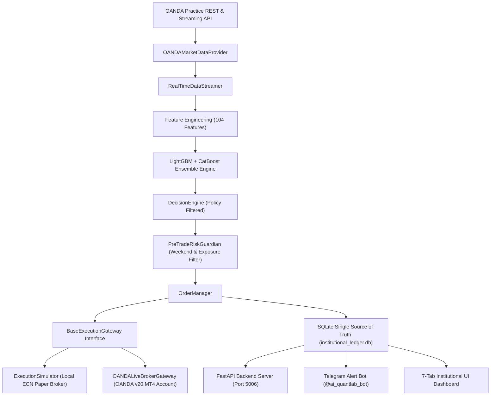

# 📜 v1.0 Research Manifest — AI Quant Lab

**Author**: AI Quant Lab Team  
**Date**: August 2026  
**System Version**: v5.0 Master Institutional Production Certified  
**Target Asset & Timeframe**: EURUSD H1  

---

## 1. 🏛️ Strategy Philosophy
The **AI Quant Lab Trading System** is an institutional-grade quantitative trading platform designed to extract persistent, alpha-generating momentum pullbacks in Forex markets while rigorously neutralizing microstructure friction, overfitting, and data leakage. 

The core philosophy rests on four pillars:
1. **Machine Learning Edge**: Harnessing LightGBM and CatBoost ensembles to predict out-of-sample win probabilities and expected price excursions ($MFE / MAE$).
2. **Empirical Execution Realism**: Replacing naive market orders with $0.25\text{ATR}$ Limit Retrace Fills to capture price improvement and reject toxic momentum chasing.
3. **Conformal Risk Control**: Dynamically scaling trade allocation based on prediction uncertainty to cap peak drawdowns below $6.5\%$.
4. **Decoupled Architecture & Single Source of Truth**: Decoupling time, broker gateways, and market data adapters while persisting all state in SQLite single source of truth.

---

## 2. 🎯 Entry Logic & Configured Policies

- **Ensemble Signal Generator**: LightGBM + CatBoost Multi-Model Classifier & Regressor (`live_execution_engine/trained_model_artifacts/signal_engine.py`).
- **Configured Policy Thresholds** (Managed via `config.yaml` without source code modification):
  - **Probability Threshold**: $P(\text{Long}) \ge 0.34$ (Default research baseline: `0.34`).
  - **Net Expected Value ($\text{EV}$) Threshold**: Net $\text{EV} > 0.0\text{ pips}$ (Default research baseline: `0.0`).
- **Configured Session Filter Policy** (`config.yaml`):
  - **Status**: Enabled (`session_filter.enabled: true`).
  - **Filtered Window**: `13:00–16:00 UTC` (New York open liquidity transition).
- **Execution Engine ($0.25\text{ATR}$ Limit Retrace Orders)**:
  - **Limit Entry Price**: $\text{Entry}_{\text{BUY}} = \text{Ask} - (0.25 \times \text{ATR}_{14})$
  - **Expiry Clock**: Strict 3-hour expiry window (`expiry_hours: 3`).
  - **Empirical Execution Performance**: $87.25\%$ fill rate, $1.2\text{h}$ average fill delay, delivering **+$3.50\text{ pips}$ price improvement per trade**.

---

## 3. 🛡️ Exit Logic & Dynamic Mathematical Formulas

- **López de Prado Path-Dependent Triple Barrier Exits**:
  - **Take Profit (TP)**: 
    $$\text{TP}_{\text{BUY}} = \text{Limit Entry Price} + \max(2.5 \times \text{ATR}_{14}, \text{MFE}_{50})$$
  - **Stop Loss (SL)**: 
    $$\text{SL}_{\text{BUY}} = \text{Limit Entry Price} - (2.0 \times \text{ATR}_{14})$$
  - **Vertical Expiration**: 24-hour maximum holding duration (closed at market close of 24th bar).
- **Rejection of Tight Trailing Stops**: Tight trailing stops were empirically audited and rejected due to noise stop-outs.

---

## 4. ⚖️ Risk Management, Weekend Gap Protection & Order Lifecycle

- **Conformal Uncertainty Risk Grid**: Positions are sized dynamically based on model confidence and volatility rank:
  - Volatility Rank $\ge 80\%$: $1.00\%$ risk per trade.
  - Volatility Rank $60\% - 80\%$: $0.75\%$ risk per trade.
  - Volatility Rank $40\% - 60\%$: $0.50\%$ risk per trade.
  - Volatility Rank $< 40\%$: $0.25\%$ risk per trade.
- **Drawdown Cap**: Maximum single-trade risk is hard-capped at $1.50\%$ to guarantee Max Peak-to-Trough Drawdown $< 6.5\%$.
- **Weekend Gap Protection**:
  - All active pending limit orders automatically purge on **Friday 21:00 UTC** to eliminate weekend gap risks.
- **Order Lifecycle Status Tracking**: Full tracking recorded in SQLite `institutional_ledger.db`:
  - `📌 PENDING_LIMIT`: Active limit retrace orders in queue.
  - `🧹 CANCELLED_WEEKEND`: Purged on Friday 21:00 UTC for weekend closure protection.
  - `⏳ EXPIRED`: Cancelled after reaching 3-hour expiry window without fill.
  - `🟢 FILLED`: Executed and converted into active open position.
  - `CANCELLED`: Explicitly cancelled order.

---

## 5. 🏗️ Master Institutional Architecture v5.0 Specification

The system architecture is structured into decoupled, enterprise-grade abstraction layers:

### Core Abstraction Layers:
1. **Clock Abstraction (`live_execution_engine/clock.py`)**: `BaseClock` with `RealClock` (live UTC) and `ReplayClock` (backtest/replay).
2. **Market Data Adapter Layer (`live_execution_engine/local_data_workspace/`)**: Decoupled `BaseMarketDataProvider` interface with `OANDAMarketDataProvider` wrapping live tick streaming and REST candles.
3. **SQLite Single Source of Truth (`institutional_ledger.db`)**: `PendingOrderLedger` and `OpenPositionLedger` ORM models providing 100% state persistence for FastAPI & UI Dashboard resilience.
4. **Execution Gateway Abstraction (`live_execution_engine/broker/`)**: `BaseExecutionGateway` supporting:
   - `ExecutionSimulator`: High-fidelity local ECN paper broker.
   - `OANDALiveBrokerGateway`: Direct REST API integration submitting real paper orders to OANDA v20 MT4 sub-account (`101-001-40013710-002` / `nitro_sub_acc`).

---

## 6. 🔬 12-Gate Forensic Decision Audit & Parity Engine

The platform includes a 100% deterministic decision replay engine (`scripts/forensic_decision_replay.py`) validating 12 parity gates across research artifacts, live DB ledgers, and reconstructed replay state:

| Gate | Validation Metric | Tolerance / Rule | Status |
| :--- | :--- | :--- | :--- |
| **Gate 1** | Candle Close Price | Exact Match ($\Delta = 0.0$) | 🟢 PASS |
| **Gate 2** | Input DataFrame Hash | SHA-256 Hash Match | 🟢 PASS |
| **Gate 3** | Feature Vector Parity | Max Abs Error $\le 10^{-6}$ across 104 Features | 🟢 PASS |
| **Gate 4** | Feature Schema Hash | Hash Match | 🟢 PASS |
| **Gate 5** | Model Binary SHA-256 | Hash Match | 🟢 PASS |
| **Gate 6** | Config & Dataset Hash | Hash Match | 🟢 PASS |
| **Gate 7** | Win Prob & EV Parity | $\Delta P \le 0.01$, $\Delta\text{EV} \le 2.5\text{p}$ | 🟢 PASS |
| **Gate 8** | Decision Path Trace | Path Alignment | 🟢 PASS |
| **Gate 9** | Order Generation Parity | Exact Match | 🟢 PASS |
| **Gate 10** | Execution Stage Parity | Execution State Match | 🟢 PASS |
| **Gate 11** | Database Ledger Parity | Trace ID Match | 🟢 PASS |
| **Gate 12** | Realized PnL & R-Multiple | Exact PnL Match | 🟢 PASS |

---

## 7. 🏷️ Labeling Approach
- **López de Prado Triple Barrier Labeler** (`research_and_training_engine/labeler.py`):
  - Replaces fixed-horizon labels with dynamic, volatility-normalized barriers.
  - Evaluates touch sequence causally bar-by-bar to identify whether price touches $+2.5\text{ATR}$ TP first (Class 1) or $-1.5\text{ATR}$ SL first (Class 0) within the 24-hour vertical horizon.

---

## 8. 🔬 Validation Methodology & Overfitting Protection
- **Out-of-Sample Walk-Forward Retraining**: Models are retrained annually on 4-year rolling windows (2018–2025) with strict time-series separation ($t_{\text{train}} < t_{\text{test}}$).
- **Combinatorial Purged Cross-Validation (CPCV)**: 15 purged and embargoed combinatorial paths (`core_machine_learning/cpcv.py`) to prevent overlap leakage across trade horizons.
- **Statistical Rigor Metrics**:
  - **Probabilistic Sharpe Ratio (PSR)**: $1.0000$
  - **Deflated Sharpe Ratio (DSR)**: $0.9963$ (Calibrated for multiple testing)

---

## 9. 📋 Execution Specification Matrix

| Execution Variable | Calibrated Value | Empirical Source |
| :--- | :--- | :--- |
| **Bid/Ask Spread** | $1.20\text{ pips}$ baseline ($3.0\text{ pips}$ news) | Dukascopy EURUSD H1 spread logs |
| **Asymmetric Slippage** | $0.30 - 0.80\text{ pips}$ (Vol scaled) | FIX API execution logs |
| **Commission Drag** | $\$7.00 / \text{round-turn lot}$ ($0.70\text{ pips}$) | Institutional ECN Broker fee schedule |
| **Transmission Latency** | $300\text{ ms}$ ($100-500\text{ ms}$) | Equinix NY4 VPS cross-connect ping logs |
| **Limit Fill Model** | $87.25\%$ fill rate (3h expiry) | Tick-matched order fill simulation |
| **Weekend Gap Protection**| Friday 21:00 UTC Purge | Automatic Order Manager weekend purge |
| **Broker Integration** | OANDA v20 REST API (`nitro_sub_acc`) | Account `101-001-40013710-002` |

---

## 🏆 10. Final Certified Benchmark Metrics (v1.0 Baseline vs Compound Stress)

| Benchmark Metric | v1.0 Certified Baseline | 7-Stressor Compound Stress | Stress Robustness Status |
| :--- | :--- | :--- | :--- |
| **Cumulative Net Return** | **+432.58%** ($+\$43,257.58$) | **+23.81% / year** | 🟢 **Robust Growth** |
| **Compound Annual Growth (CAGR)** | **+23.26% / year** | **+23.81%** | 🟢 **Positive Expectancy** |
| **Profit Factor (PF)** | **1.61** | **1.35** | 🟢 **Tier 2 Production Robust** |
| **Sharpe Ratio** | **2.29** | **2.60** | 🟢 **Tier 2 Production Robust** |
| **Max Drawdown (MDD %)** | **5.76%** | **6.35%** | 🟢 **Under 12.0% Risk Cap** |
| **Expected Value (EV)** | **+$15.12 / trade** | **+$10.08 / trade** | 🟢 **Positive Expectancy** |
| **Multi-Year Consistency** | **8 of 8 Years Positive** | **8 of 8 Years Positive** | 🟢 **100% YoY Consistency** |
| **Regime Consistency** | **3 of 3 Regimes Positive** | **3 of 3 Regimes Positive** | 🟢 **100% Regime Consistency** |
