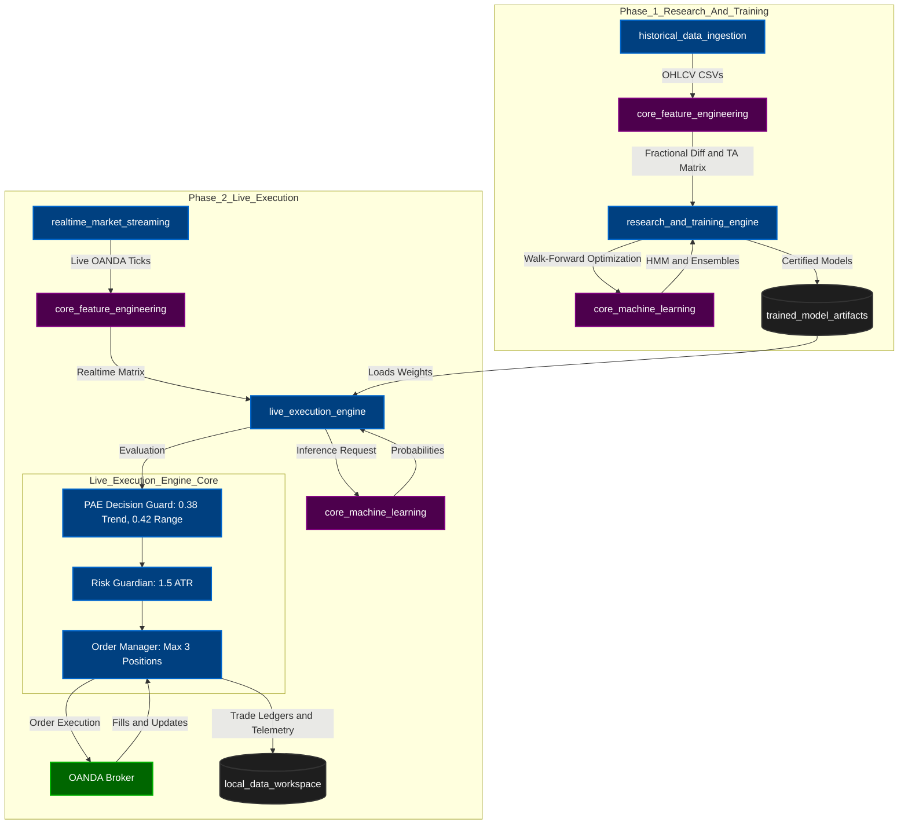

# 🏛️ Institutional AI Quant Lab: v3.2 Master Architecture

This document provides a definitive map of your newly restructured algorithmic trading repository. The system is split cleanly into **Core Libraries**, **Offline Research**, **Live Execution**, and **Storage**. 

This structure ensures that data ingestion, model training, and real-time execution are completely decoupled but share the exact same underlying mathematical logic (Features & ML).

---

## 🗺️ Visual Architecture Diagram

---

## 📁 Directory Dictionary (What everything does)

### 1. The Core Shared Libraries (Used by both Research & Live)
These folders contain stateless mathematical logic. They don't run on their own; they are imported by the engines.
*   **`core_machine_learning/`** *(formerly ai_engine)*: Contains the raw classes for the 4-State HMM Regime filter and the LightGBM/CatBoost Ensembles.
*   **`core_feature_engineering/`** *(formerly feature_engine)*: Contains the logic to turn raw OHLCV prices into Fractional Differentiation features and Technical Indicators. 

### 2. The Heavy Lifters (The Execution Engines)
*   **`research_and_training_engine/`** *(formerly research_engine)*: This is your **Offline Lab**. It uses `historical_data_ingestion` to backtest strategies, optimize thresholds (like the 1296 grid sweep), and train the final models.
*   **`live_execution_engine/`** *(formerly live_trading_engine)*: This is your **Online Factory**. It powers the live daemon (`run_paper_trading.py`). It ingests live market streams, loads the trained models, runs the `PAEDecisionGuard`, sizes the risk (`RiskGuardian`), and physically sends trades to OANDA.

### 3. Data Pipelines (Getting prices into the system)
*   **`historical_data_ingestion/`** *(formerly data_loader)*: Scripts to download 12+ years of historical data for backtesting.
*   **`realtime_market_streaming/`** *(formerly market_data_pipeline)*: The WebSocket and REST API adapters that feed live, second-by-second data to the `live_execution_engine`.

### 4. Storage & Configurations (The persisting state)
*   **`production_deployment/`** *(formerly production)*: Contains the top-level scripts you actually run. (e.g., `test_e2e_live_trading_pipeline.py`, `eval_2026.py`, and the live `config.yaml`).
*   **`trained_model_artifacts/`** *(formerly models)*: The `.joblib` files generated by the research engine and consumed by the live engine.
*   **`local_data_workspace/`** *(formerly data)*: The central hub for all dynamically generated outputs: SQLite ledgers, app logs, and telemetry data.
*   **`documentation_and_ledgers/`** *(formerly docs)*: Where your canonical certified markdown results and roadmaps live. It is now strictly structured into:
    *   `canonical_baselines/`: The MASTER CANONICAL PRODUCTION folder containing strictly the certified v2 and v3 production baseline ledgers and markdown certifications.
    *   `architectural_maps/`: Contains this v3 architecture map, ml pipeline diagrams, and project architecture docs.
    *   `roadmaps_and_plans/`: Future plans, research manifests, and the v6 institutional roadmaps.
    *   `historical_audits_and_reports/`: Old ablation sweeps, red team stress tests, and legacy components ledgers.
    *   `archived_reports/`: Old JSON and markdown backtest progress reports that are no longer strictly canonical.

---

## 🔄 The Master Workflow (How to use it)

If you ever need to iterate or update the system, the workflow is strictly linear:

1. **Research Phase**: You run tests inside `research_and_training_engine/scripts/` to find a better configuration (e.g., finding the `0.38 / 0.42` hurdle).
2. **Training Phase**: You run `production_deployment/scripts/train_and_export_baseline_v3.py` to freeze the models into `trained_model_artifacts/`.
3. **Verification Phase**: You run `production_deployment/live_engine/test_e2e_live_trading_pipeline.py` to ensure the live execution pipeline seamlessly loads those exact models and executes without crashing.
4. **Live Trading**: You execute `production_deployment/live_engine/run_paper_trading.py` and monitor the trades flowing into `local_data_workspace/databases/institutional_ledger.db`.
